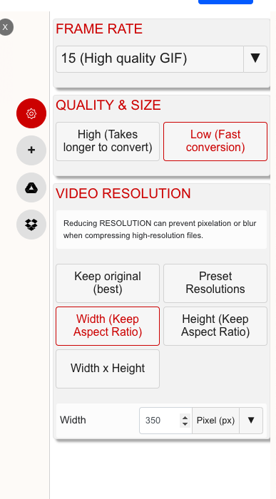

Steps to add new game
---
1) Make video of few seconds of game. See section below "How I created the GIF animations" for this.
2) Create thumbnail picture for the game
3) Add new line starting with `<div class="imageBox"` to `index.html` file. Modify the values for video, picture and description appropiately.
4) That's it. 

How I created the GIF animations:
-----

1) Record video from desktop with width and height being equal
2) Upload to https://www.xconvert.com/convert-mov-to-gif
3) Convert to gif with these settings

